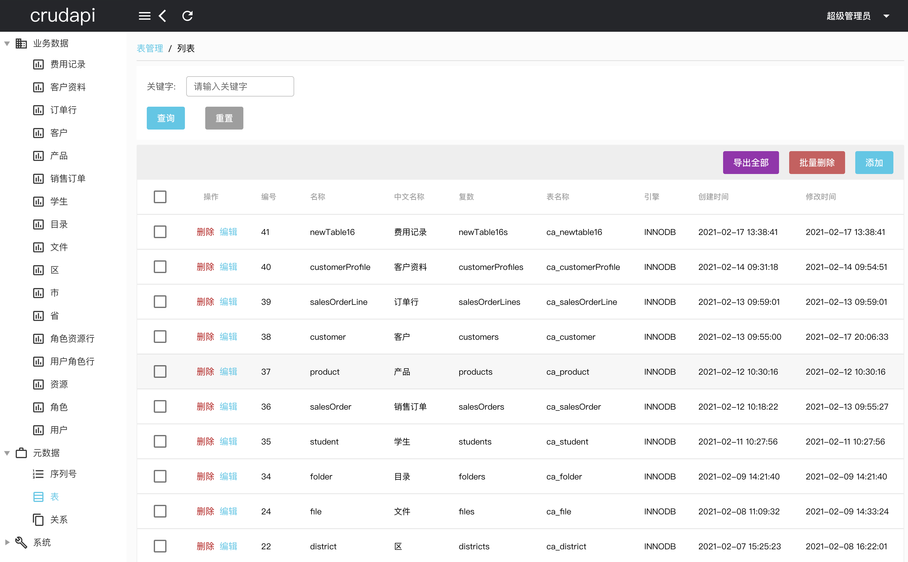
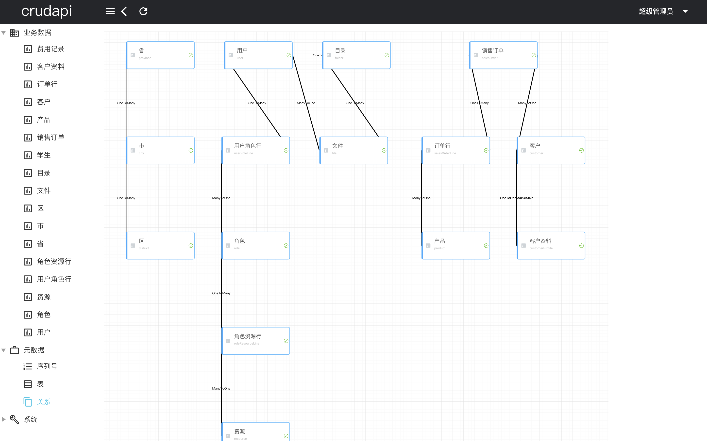
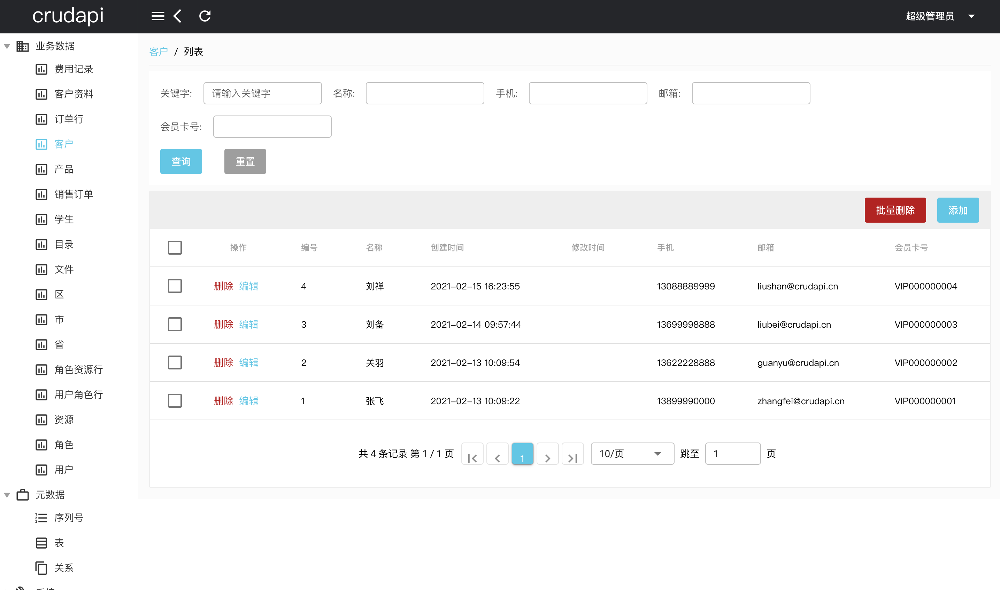

# Crudapi Admin Web (crudapi-admin-web)

## Language
[中文](README_CN.md)

## GIT URL
Name | Type | License | GitHub| Gitee
--- | --- | --- | --- | ---
crudapi-admin-web | Vue Qusar Code | Open Source | [crudapi-admin-web](https://github.com/crudapi/crudapi-admin-web) | [crudapi-admin-web](https://gitee.com/crudapi/crudapi-admin-web)
crudapi-example| Java SDK | Free | [crudapi-example](https://github.com/crudapi/crudapi-example) | [crudapi-example](https://gitee.com/crudapi/crudapi-example)
crudapi-pro-example | Java Pro SDK  | Bussiness | [crudapi-pro-example](https://github.com/crudapi/crudapi-pro-example) | [crudapi-pro-example](https://gitee.com/crudapi/crudapi-pro-example)

## Install the dependencies
```bash
npm install
```

## Start the app in development mode (hot-code reloading, error reporting, etc.)
```bash
npm run dev
```

## Lint the files
```bash
npm run lint
```

## Build the app for production
```bash
npm run build
```

## Docker
```bash
docker build -t crudapi-admin-web:latest .
docker rm -f crudapi-admin-web
docker run -d -p 80:80 --name crudapi-admin-web crudapi-admin-web:latest
```
Visit [ http://127.0.0.1/crudapi ](http://127.0.0.1/crudapi)

## Documentation

[https://help.crudapi.cn](https://help.crudapi.cn)

1. [ 基于Vue和Quasar的前端SPA项目实战之环境搭建（一）](https://help.crudapi.cn/crudapi-admin-web/helloworld.html)
2. [ 基于Vue和Quasar的前端SPA项目实战之用户登录（二）](https://help.crudapi.cn/crudapi-admin-web/login.html)
3. [ 基于Vue和Quasar的前端SPA项目实战之布局菜单（三）](https://help.crudapi.cn/crudapi-admin-web/layout.html)
4. [ 基于Vue和Quasar的前端SPA项目实战之序列号（四）](https://help.crudapi.cn/crudapi-admin-web/sequence.html)
5. [ 基于Vue和Quasar的前端SPA项目实战之动态表单（五）](https://help.crudapi.cn/crudapi-admin-web/metadatatable.html)
6. [ 基于Vue和Quasar的前端SPA项目实战之表关系（六）](https://help.crudapi.cn/crudapi-admin-web/metadatarelation.html)
7. [ 基于Vue和Quasar的前端SPA项目实战之业务数据（七）](https://help.crudapi.cn/crudapi-admin-web/business.html)
8. [ 基于Vue和Quasar的前端SPA项目实战之docker部署（八）](https://help.crudapi.cn/crudapi-admin-web/docker.html)
9. [ 基于Vue和Quasar的前端SPA项目实战之数据导入（九）](https://help.crudapi.cn/crudapi-admin-web/import.html)
10. [ 基于Vue和Quasar的前端SPA项目实战之文件上传（九）](https://help.crudapi.cn/crudapi-admin-web/fileupload.html)
11. [ 基于Vue和Quasar的前端SPA项目实战之联合索引（十一）](https://help.crudapi.cn/crudapi-admin-web/unionindex.html)
12. [ 基于Vue和Quasar的前端SPA项目实战之数据库逆向（十二）](https://help.crudapi.cn/crudapi-admin-web/dbfirst.html)
13. [ 基于Vue和Quasar的前端SPA项目实战之数据导出（十三）](https://help.crudapi.cn/crudapi-admin-web/export.html)
14. [ 基于Vue和Quasar的前端SPA项目实战之模块管理（十四）](https://help.crudapi.cn/crudapi-admin-web/module.html)
15. [ 基于Vue和Quasar的前端SPA项目实战之元数据导出导入（十五）](https://help.crudapi.cn/crudapi-admin-web/metadataexportimport.html)

Ongoing updates...

## Demo
Demo url：[https://demo.crudapi.cn/crudapi/](https://demo.crudapi.cn/crudapi/)


Metadata table


Table relation


Bussiness Data

## Java SDK development
### GitHub repo
[https://github.com/crudapi/crudapi-example](https://github.com/crudapi/crudapi-example)

### Gitee repo
[https://gitee.com/crudapi/crudapi-example](https://gitee.com/crudapi/crudapi-example)

## Contact
#### Email
admin@crudapi.cn

#### QQ
1440737304

#### Weixin
undefinedneqnull

<div align="left">
  
</div>

#### WeixinQun
<div align="left">
  
</div>

If you have any questions, please contact us!

## License

Copyright (c) 2021-present crudapi

[MIT License](http://en.wikipedia.org/wiki/MIT_License)
